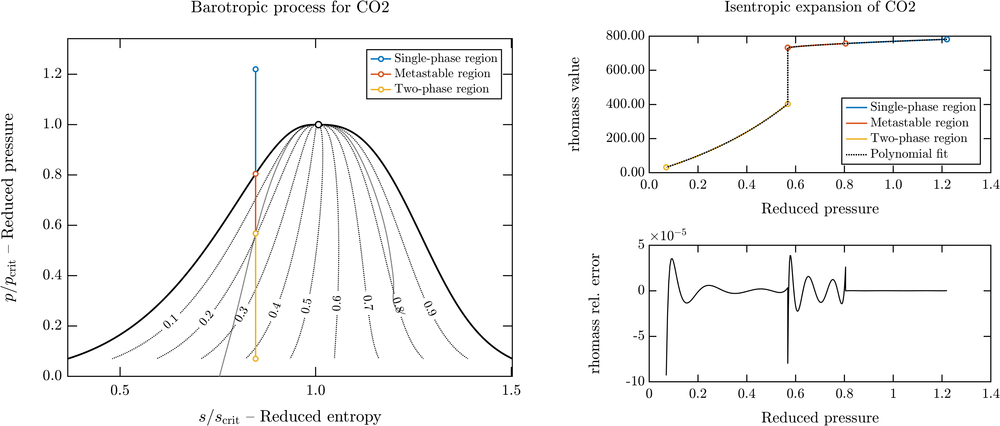

# Barotropic Model 

## Description
This repository contains functions to generate a barotropic model for fluid properties. A barotropic model is a simplified mathematical representation that assumes the fluid's properties are only a function of pressure. This is simplification can be useful to model flows in which the fluid approximatelly follows a known thermodynamic process, such as an isentropic process within a turbine or compressor

>Note that using a barotropic model in the context of a CFD simulation does not imply that the flow is frictionless since the momentum equations can have dissipation terms due to viscous friction. Instead, the implication of using the barotropic model is that the variation of fluid properties caused by viscous dissipation (i.e., entropy generation and heating) is ignored.

The script `barotropic_model.m` evaluates the properties of the fluid (e.g., density, viscosity, heat capacity, conductivity) along a line of constant entropy using the CoolProp library. Once computed, the fluid properties are automatically fitted with piece-wise polynomials and exported as [Fluent Expressions](https://ansyshelp.ansys.com/account/secured?returnurl=/Views/Secured/corp/v232/en/flu_ug/flu_ug_expressions_intro.html) to be used in conjuction with Fluent's pressure-based solver.

The fluid properties between the saturation line and the spinodal line can be computed according to phase-equilibrium or by extrapolation the Helmholtz-energy equation of state into the metastable region. Check the [documentation](./documentation/thermodynamic_properties.md) for more information about extrapolating the equation of state beyond the saturation line and its limitations.


## Getting started

The installation instructions ar edetailed in the next section. The script below contains a minimum working example to get started with the code:

``` matlab
%% Minimum working example showcasing the barotropic model
% Clear the workspace
clear all %#ok
close all
clc

% Add path to utility functions
addpath(genpath("dependencies"))

% Set plot options
save_figures = false;
set_plot_options()

% Define the fluid name and create the fluid object
fluid_name = 'CO2';
fluid = FluidCoolProp_2Phase('HEOS', fluid_name);

% Define the inlet state
T_in = 300; % Kelvin degrees
p_in = 90e5; % Pascals

% Define the order of the polynomials
polynomial_order = 6;

% Extrapolate equation of state between the saturation and spinodal lines
include_metastable = true;

% Compute properties along isentrope
isentrope_segments = create_barotropic_model(T_in, p_in, fluid, ...
                                             include_metastable=include_metastable, ...
                                             polynomial_order=polynomial_order, ...
                                             properties={'rhomass'});

% Plot barotropic process in p-s diagram
plot_barotropic_process_ps(fluid, isentrope_segments, ...
                           save_figures=save_figures, ...
                           plot_spinodal_line=true, ...
                           spinodal_line_method='robust', ...
                           plot_quality_isolines=true, ...
                           quality_labels=true, ...
                           show_in_legend=false)

% Plot barotropic model fitting
plot_barotropic_polynomials(fluid, isentrope_segments, save_figures=save_figures)

% Export fitted polynomials
export_fluent_expressions(fluid, isentrope_segments)

```

Executing this script will evaluate the density of carbon dioxide along the isentrope passing through the thermodynamic state defined by $T=300$ K and $p=90$ bar. If we set `include_metastable=true`, the code will extrapolate the equation of state between the saturation and spinodal lines. Therefore, the isentrope line will be divided in 3 segments:
1. Single-phase region
2. Metastable region
3. Two-phase region

In addition, the script will fit a polynomial of degree 4 to each of the isentrope segments and will plot the piece-wise polynomials and the fitting error:




Finally, the code will generate the following Fluent Expression that can be directly copy-pasted into the [Fluent Expression Manager](https://ansyshelp.ansys.com/account/secured?returnurl=/Views/Secured/corp/v232/en/flu_ug/flu_ug_expressions_create_and_use.html):

```
Fluent expressions of CO2 properties along an isentrope
Creation datetime: 14-Aug-2023 15:24:58

rhomass_barotropic_model_CO2
IF(AbsolutePressure>=5.179643e+05 [Pa], 
IF(AbsolutePressure>=4.189928e+06 [Pa], 
IF(AbsolutePressure>=5.936887e+06 [Pa], 
+6.381823e+02 + (AbsolutePressure/7.377300e+06 [Pa])*
(+2.748104e+02 + (AbsolutePressure/7.377300e+06 [Pa])*
(-2.408267e+02 + (AbsolutePressure/7.377300e+06 [Pa])*
(+1.217994e+02 + (AbsolutePressure/7.377300e+06 [Pa])*
(-2.491639e+01)))), 
-1.123298e+03 + (AbsolutePressure/7.377300e+06 [Pa])*
(+1.004366e+04 + (AbsolutePressure/7.377300e+06 [Pa])*
(-2.056259e+04 + (AbsolutePressure/7.377300e+06 [Pa])*
(+1.890792e+04 + (AbsolutePressure/7.377300e+06 [Pa])*
(-6.534217e+03))))), 
+1.298915e+00 + (AbsolutePressure/7.377300e+06 [Pa])*
(+4.120057e+02 + (AbsolutePressure/7.377300e+06 [Pa])*
(+3.715987e+02 + (AbsolutePressure/7.377300e+06 [Pa])*
(+7.977732e+01 + (AbsolutePressure/7.377300e+06 [Pa])*
(+3.169611e+02))))), 
3.209318e+01*exp((AbsolutePressure - 5.179643e+05 [Pa])/7.377300e+06 [Pa])) * 1 [kg/m^3]
```

Note the following aspects of the Fluent expression:
- The absolute pressure is normalized by the critical pressure to improve the [conditioning of the polynomial fitting](https://www.mathworks.com/help/matlab/ref/polyfit.html).
- The polynomials are represented in [Horner's form](https://en.wikipedia.org/wiki/Horner%27s_method) to reduce the computational cost and improve the numerical stability of the model.
- The expression uses an exponential function to extend the properties below the triple pressure. This is necessary to ensure that the barotropic model can handle negative pressures that might take place before the Fluent solver converges to a physically meaningful solution.


## Installation
In order to use the code you need a MATLAB installation. Also, make sure that the `barotropic_model.m` script includes a code-line to add the folder [`dependencies`](./dependencies) to the MATLAB path:
``` matlab
addpath(genpath("dependencies"))
```
In addition, you need to install the CoolProp fluid property library and interface it with MATLAB through Python. Check the step-by-step instructions below to learn how to interface MATLAB with CoolProp in a Windows operating system. The installation for Linux or Mac operating systems would be similar.
#### Step 1 - Download and install Miniconda
[Download the installer](https://docs.conda.io/projects/conda/en/latest/user-guide/install/windows.html) and follow the instructions until the installation is completed.

In order to use the Conda from from the [Git Bash](https://gitforwindows.org/) teminal, you have to initialize it in your terminal session. The easiest way to achieve this in a permanent way is to modify your `.bashrc` file to initialize conda each time that bash is started. Open your bash terminal and type the following command:
  ``` bash
  echo ". \${HOME}/AppData/Local/miniconda3/etc/profile.d/conda.sh" >> ~/.bashrc
  ```
This will add a new line to your `.bashrc` file that will execute `conda.sh` each time that you open the bash terminal. To check if the command worked, you can open your `.bashrc` file:
  ```bash
  notepad ~/.bashrc 
  ```
  
#### Step 2 - Create a virtual environment and install CoolProp
Open a new Git Bash terminal and type the following command to create a new virtual environment named `coolprop_env`:
```shell
conda create --name coolprop_env python=3.8
```
Now that the environment is created, you can activate it. Just use the following command:
```shell
conda activate coolprop_env
```
Finally, type the following command to install CoolProp:
```shell
conda install CoolProp --channel conda-forge
```
That's it! Note that it was necessary to tell Miniconda that it should look for Coolprop in the `conda-forge` channel.

#### Step 3 - Interface MATLAB and Coolprop
Open MATLAB (or close and open it if it was already open) and type the following command to let MATLAB know where is the Python executable (python.exe) of the virtual environment that you have just created:
```matlab
pyversion(fullfile(char(java.lang.System.getProperty('user.home')), '\AppData\Local\miniconda3\envs\coolprop_env\python.exe'))
```
This command will find the Python executable of the `coolprop_env` environment installed in your home directory.

Good! You have installed CoolProp and interfaced it with MATLAB. Let's do a simple test to check if the installation was successful. We are going to use CoolProp to compute the saturation temperature of water at atmospheric pressure. Just type the following command in MATLAB:
```matlab
py.CoolProp.CoolProp.PropsSI('T','P',101325,'Q',0,'Water')
```
If this does not throw and error and returns 373.1243 K, the installation was successful.


## License
The code in this repository is licensed under the terms of the MIT license. See the [license file](LICENSE.md) for more information.


## Contact information
The code in this repository was developed by Roberto Agromayor at the Department of Civil and Mechanical Engineering of DTU. Drop an email to roagr@dtu.dk if you have questions about the code or you have a bug to report!


## Installation advanced
If you are using [Conda](https://docs.conda.io/projects/conda/en/latest/user-guide/install/windows.html), you can use the following [Bash](https://gitforwindows.org/) command to create a new virtual environment with all the dependencies required to run the code in this repository:
``` bash
conda env create --file environment.yaml
```
This will create the `barotropic_env` virtual environment and install all the packages in the specified in the YAML file.

To activate the virtual environment use:
``` bash
conda activate barotropic_env
```
If you need to install additional packages you can use the following command:
``` bash
conda install <name of the package>
```
You can also install new packages by adding their names to the `environment.yaml` file and updating the environment (using `--prune` removes any dependencies that are no longer required):
``` bash
conda env update --file environment.yaml --prune
```


