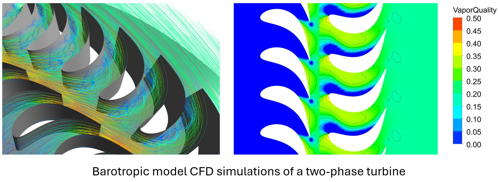
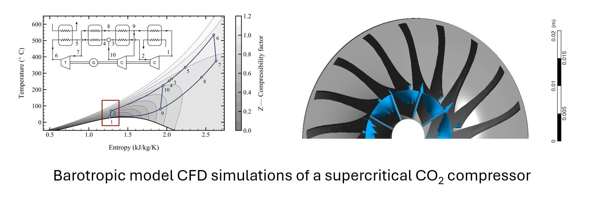

# Barotropy

Enhance your turbomachinery CFD simulations with **`barotropy`**, a Python package designed to create barotropic fluid property models. The barotropic approximation assumes that fluid properties (e.g., density, viscosity, speed of sound) depend solely on pressure, which is a very accurate assumption for most turbomachinery flows. This simplification reduces computational costs while improving convergence reliability in simulations involving complex fluid property variations, such as supercritical CO₂ compressors or two-phase flows in nozzles and turbines.

## Key Features

- **Simplified Fluid Modeling:** Generate barotropic models to lower computational cost and enhance solver robustness compared to real-gas fluid property tables.  
- **Optimized for Two-Phase Flows:** Simulate two-phase flows with one or two-components using the Homogeneous Equilibrium Model (HEM) or the Delayed Equilibrium Model (DEM) assumptions..  
- **Seamless Integration with Commercial CFD Solvers:** Easily export barotropic models as simple expressions ready to be copy-pasted into ANSYS Fluent or ANSYS CFX.  


<p align="center">
  
</p>

<p align="center">
  
</p>


## Getting Started

To begin using `barotropy`, install it via `pip`:

```bash
pip install barotropy
```

After installation, verify that everything is set up correctly by running the following command in your terminal:

```bash
python -c "import barotropy; barotropy.print_package_info()"
```

For detailed information and examples, visit the [documentation page](https://turbo-sim.github.io/barotropy/).


## License
The code in this repository is licensed under the terms of the MIT license. See the [license file](LICENSE.md) for more information.


## Contact Information

The code in this repository was developed by the [Sustainable Thermal Power group](https://thermalpower.dtu.dk/) at [DTU Construct](https://construct.dtu.dk/). Drop us an email at [roagr@dtu.dk](mailto:roagr@dtu.dk) if you have questions about the code or have a bug to report!

