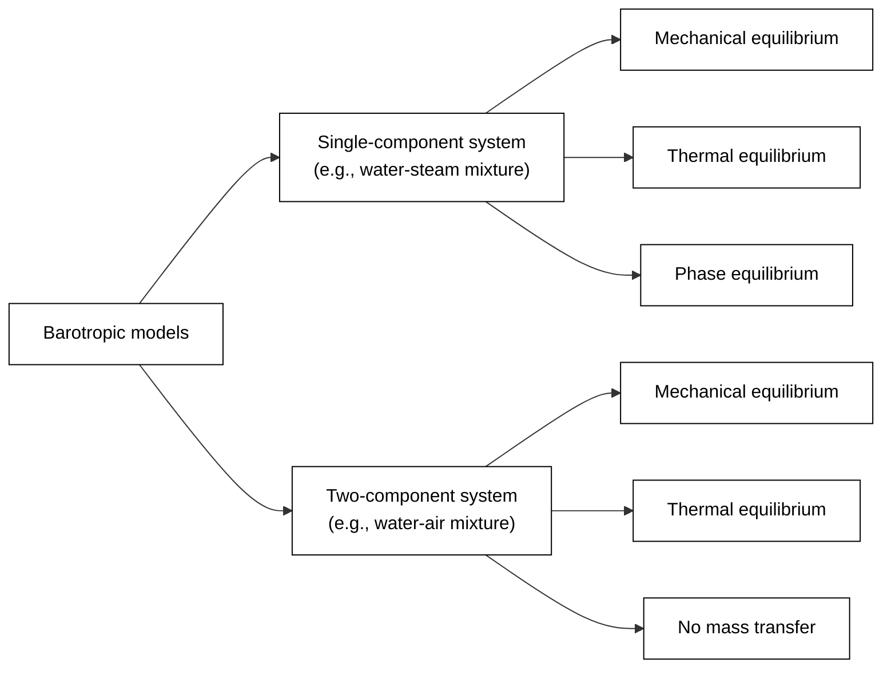

## Barotropic models for multi-phase flows in turbomachinery

A **barotropic fluid model** is a simplified mathematical representation of a fluid's thermophysical behavior based on the assumption that all thermodynamic and transport properties depend **only on pressure**. In particular, barotropic fluid models can be applied effectively in the context of **homogenous multiphase flows** in turbomachines.

Homogeneous multiphase flows are characterized by uniformly dispersed phases that move at the same velocity (i.e., no relative motion). Under these conditions, the flow can be accurately represented as a single-phase system in which the effective properties of the fluid are given by weighted averages of each phase's properties. This modeling approach is relevant when the main area of interest is the aggregate behavior of the medium, rather than the individual dynamics of each phase and their interactions. A good example of this is seen in turbomachinery applications, where flow analyses usually aim to quantify overall performance indicators such as mass flow rate, pressure ratio, and efficiency.

In turbomachinery applications, the thermodynamic processes occurring within a turbine or compressor are frequently characterized by the polytropic efficiency. For turbines, the polytropic efficiency is defined as the ratio of the actual enthalpy change to the ideal (or isentropic) enthalpy change over an infinitesimally small segment of the process. Conversely, in compressors, it's defined as the ratio of the ideal to the actual enthalpy change. These definitions can be expressed as:

$$\frac{\mathrm{d}h}{\mathrm{d}h_s} = \begin{cases} \eta_p & \text{for turbines and nozzles} \\ \eta_p^{-1} & \text{for compressors and diffusers}\end{cases}$$
where:
- $h$ is the enthalpy of the fluid for the actual process
- $h_s$ is the enthalpy of the fluid for an ideal isentropic process
- $\eta_p$ is the polytropic efficiency of the machine

As we will explore below, this definition can be formulated as an ordinary differential equation (ODE) that describes evolution of the thermodynamic state along a expansion or compression as a direct function of pressure. Consequently, a barotropic fluid model can be utilized to determine the fluid's thermodynamic and transport properties.

### Computational advantages

Utilizing the barotropic fluid model for homogeneous multiphase flows presents distinct computational benefits. Foremost, it streamlines the computational models. Instead of dealing with multifaceted multiphase equations, researchers only need to tackle the Reynolds Averaged Navier Stokes equations tailored for a single-phase system. This requires solving just the mass and momentum equations of the mixture, which are further enhanced by a turbulence model. 

There's no necessity to introduce additional transport equations or incorporate source terms that reflect the dynamics of individual phases. Instead, the entire flow is represented as a single-phase system, leveraging the thermodynamic and transport properties of the mixture. Impressively, the outcomes remain illustrative of the multiphase flow dynamics. 

Moreover, the energy equation doesn't have to be engaged to discern the thermodynamic state since the properties are uniquely pressure-dependent, in line with the barotropic connection. This simplicity not only trims down computational expenses but also augments the model's robustness when contrasted with other multiphase models. 

Finally, the barotropic model can be effortlessly integrated into multidimensional CFD solvers with only slight alterations. This framework is particularly apt for single-phase pressure-based CFD solvers, and yet, it still captures nuances inherent to intricate multiphase flows.

---

Points:
- One of the main advantages of using the barotropic fluid model to describe homogeneous multuphase flows is the simplification it brings to computational models.
- The flow equations are the Reynodls Averaged Navier Stokes equations for a single phase system. It is only necessary to solve the mass and momentum equations of the mixture, supplemented by a turbulence model.
- No need to use additional transport equations or add source terms to take into account the dynamics of each phase. The flow is modeled as a single phase system using the themrodynamic and transport properties of the mixture. The results are representative of the multi-phase flow.
- No need to solve the energy equation to determine the thermodynamic state. The thermodynamic properties depend only on pressure according to the barotropic relation. 
- As a result the model is less computationally expensive than other multiphase models and more robust
- Easily integrated into multidimensional CFD solvers with minimal modifications. In particular, the barotropic model formulation is suitable for implementation in the context of single-phase pressure-based CFD solvers, while capturing some of the features of complex multiphase flows

**Simplification for Computational Models**: One of the advantages of assuming barotropic behavior in homogeneous multiphase flows is the simplification it brings to computational models. The dynamics can be reduced to pressure-based calculations without needing to account for complexities introduced by temperature or composition dependencies.

---
- Simplified description of the flow, Simulate a single phase system, but get results representative of the two-phase system. More robust and computationally less expensive
- The main limitation of the model cannot capture the gradual exchange of volume/heat/mass between the phases, which as often modeled as source terms in othe rmultiphase flow models) (each phase has its own transport equation).
- Despite this, the model can capture some asymptotic cases of great engineering relevance.
- However, these phenomena often occur very quickly, such that from and engineering point of view it is reasonable to assume that the two phases are in thermodynamic equilibrium (single-component model) or that the two phases are in mechanical/thermal equilibrium and there is no mass transfer between phases

---

model can be implemented in the context of a multi-dimensional computational fluid-dynamic (CFD) framework

pressure-based flow solve for the continuity, momentum, and turbulence model of the mixture treated as a single phase fluid

The flow equations are simply the single-phase reynolds averaged navier stokes equations:
- Continuity
- Momentum
- Turbulence model
in which the fluid has the properties of the mixture

the barotropic fluid model decouples the mechanical from the thermal effects, removing the need of solving the energy equation. Not solving the energu equation makes the solver inherently more robust for solving problems close to the critical point in which there are sharp gradients of thermal capacity close to the critical point. (cp appears in the energy equation.)

> Note that using a barotropic model in the context of a CFD simulation does not imply that the flow is frictionless since the momentum equations can have dissipation terms due to viscous friction. Instead, the implication of using the barotropic model is that the variation of fluid properties caused by viscous dissipation (i.e., entropy generation and heating) is ignored.

- Additional points- energy close to critical point
- Not solving the energy equation makes the barotropic inherently more robust than other CFD solvers close to the critical point
state variables. Besides preventing a straightforward application of the HEM for two-phase flows, this latter choice also complicates the convergence for single-phase flows near the critical point.
Moreover, if the specific enthalpy is the independent variable of the energy equation in the pressure-based solver, it should be converted to temperature before interrogating LUTs to evaluate fluid properties. This conversion may compromise the stability of the simulation because it involves the specific heat at constant pressure, which diverges at the critical point.

## Equilibrium in two-phase systems
In a two-phase fluid system, the vapor and liquid phases can interact through three mechanisms:
- **Volume Transfer:** driven by differences in pressure between the phases.
- **Heat Transfer:** driven by differences in temperature between the phases.
- **Mass Transfer:** driven by differences in chemical potential between phases.

The two-phase system will progress towards equilibrium over time. However, the time scales for each transport phenomenon can differ. Due to this, a two-phase system can be in equilibrium according to three different criteria:
- **Mechanical Equilibrium:** Both phases have the same pressure ($p_v=p_l$)
- **Thermal Equilibrium:** Both phases have the same temperature ($T_v=T_l$)
- **Phase Equilibrium:** Both phases have the same chemical potential, ($\mu_v=\mu_l$)

When the system reaches mechanical, thermal, and phase equilibrium simultaneously, it is said to be in **thermodynamic equilibrium**.

Two-phase flows can be classified in two main groups:
- Flows with one component (e.g., water/steam mixture)
- Flows with two-components (e.g. water/air mixture)

These two scenarios are illustrated in the diagram below

The general formula for the density of a mixture is given by:

$$\frac{1}{\rho} = \frac{y_v}{\rho_v} + \frac{y_l}{\rho_l}$$
where
- $y_v$ and $y_l$ are the mass fractions of the vapor and liquid phases, respectively
- $\rho_v$ and $\rho_l$ are the densities of the vapor and liquid phases, respectively

The general formula for the viscosity of the mixture is given by: ?

We will consider two cases:

The case of mechanical disequilibrium is not considered because volume transfer is usually very fast
The case of no heat transfer between the phases is not considered because it is unrealistic, therefore it is assumed in both models that the two phases are in thermal equilbrium and have the same temperature

**Case 1**
Two-component system with no mass transfer between the phases

Assumptions
- Mechanical equilibrium
- Thermal equilibrium
- No mass transfer between phases
	- No evaporation of the liquid
	- No dissolution of the gas
- No surface tension effects

Assumptions:
The model ignores the influence of surface tension (the bubbles are big)
The model assumes thermal and mechanical equilibrium (same pressure and temperature between phases)
- Polytropic model where the enthalpy of the fluid mixture evolves according to a polytropic process defined by ratio of delta enthalpy to delta isentropic enthalpy (representative of nozzles and turbomachinery). A particular case of this model is isentropic flow

Explain the two modeling options from matlab scripts:
- Solving one equation per point
- Derive one ODE system and integrate
Both options are correct, I prefer the ODE system because it is very easy to define non-isentropic processes.

In this case the two phases share have the same pressure
It is assumed that the heat transfer between the two phases is very fast such that they are at the same temperature
However, there is no significant mass transfer between the phases.
This is representative of a two-component system with a gas and a liquid, like a mixture of water and air
The evaporation of liquid into the gas, and the dissolution of the gas into the liquid is assumed to be negligible

Under these conditions, the density of the mixture at a certain temperature and pressure is given by

$$\frac{1}{\rho} = \frac{y_v}{\rho_v(p,T)} + \frac{y_l}{\rho_l(p,T)}$$

In this case, there is no mass transfer and the mass fractions of each component are constant, regardless of the thermodynamic process. Therefore the speed of sound of the mixture can be computed by differentiation the previous equation with respect to pressure at constant entropy:

$$ \frac{1}{\rho^2 a^2} =  \frac{y_l}{\rho_l^2 a_l^2} + \frac{y_v}{\rho_v^2 a_v^2}$$
This formula is equivalent to 
$$ \frac{1}{\rho a^2} =  \frac{\alpha_l}{\rho_l a_l^2} + \frac{\alpha_v}{\rho_v a_v^2}$$
where
- $a_l$ and $a_v$ are the speeds of sound of the liquid and gas evaluated at $(p,T)$
- $\alpha_l$ and $\alpha_v$ are the volume fractions of liquid and gas

This is the well-known Wood's formula for the speed of sound, also known as Homogeneous Frozen Model.

In the limit when the mass fraction of the flow does not change, the speed of sound is given by Woods formula (frozen equilibrium model). This is a realistic assumption for systems where there is little or no mass transfer between the phases, such as a liquid air mixture.

What happens when there is some mass transfer between the components?
- The liquid evaporates into the gas phase (psychometry calculations)
- The gas dissolves into the liquid phase (Henry's law calculations)
- The gas condenses into the liquid phase (complex vapor-liquid equilibrium)

One application of interest is the flow of a bubbly liquid. That is, the flow of a liquid containing gas bubbles.

In most cases, the temperatur eof th emixture is almost equal to the temperature of the liquid along the process because the liquid has a much higher thermal capacity than the gas

which gives significant flexibility, as it can be used to model the properties, and the real flow in a turbine or compressor characterized by an polytropic efficiency as well as the limit cases
 along an isentropic process (eta=1) ideal case, and isenthalpic process (eta=0)

>ITIS WELL KNOWN that the presence of gas bubbles in a liquid can dramaticallychange some of the fluid's physical properties which may become very different in character from the properties of either of the constituent phases. It is incorrect to presume that the relative properties of such a gas-liquid mixture lie between those of the two components, because the mixture is relatively easily compressed owing to the effect of the gas bubbles, whereas it remains relatively dense due to the dominant mass of liquid. Consequently, the presence of the bubbles causes the pressure,/density variation of the mixture to differ considerablyfrom the correspondingvariationsin both the gas and the liquid.

>A physical property which highlights the difference is the ability of the fluid to transmit a small disturbance, i.e. the velocity of sound in the fluid. For a large range of concentrations, the sonic velocity is much less in a gasliquid mixture than it is in either the gas or the liquid. For example, it is about 4860 ftjs in water and 1100 ftjs in air, but in an air-water mixture it is generally much less and falls to a minimum of about 60 ftjs when there are equal volumes of air and water. (These data are for relatively large air bubbles in water at atmospheric pressure, and were obtained through experiment and calculation by Campbell and Pitcher (I)$ and Karplus (2).) Moreover, even a very small concentration of gas is sufficient to reduce dramaticallythe sonic velocity, and a concentration of only 1 per cent by volume of air in water lowers the velocity to about 300 ftjs (i.e. by 95 per cent)

**Case 2**

Single-component system in thermodynamic equilibrium

Assumptions
- Mechanical equilibrium (no surface tension effects)
- Thermal equilibrium
- Phase equilibrium

In this case, the two phases have the same pressure, temperature and chemical potential
It is assumed that heat and mass transfer between phases is very fast such that they have the same temperature and chemical potential
This is representative of a single-component system with liquid and vapor phases, like a mixture of water and steam.

For a single component system, the density is not univocally defined by the pressure an temperature, it is necessary to specify another variable like entropy or enthalpy to specify the state. For the case of a process starting from a single-phase region and going into the two phase region (like an expansion from liquid into the two phase region) it is possible to calculate the density according to the specified thermodynamic trajectory (like a polytropic process)

$$ \frac{1}{\rho a^2} =  \frac{\alpha_l}{\rho_l a_l^2} + \frac{\alpha_v}{\rho_v a_v^2} + T \left[\frac{\alpha_g\,\rho_g}{c_{p,g}}\left(\frac{\mathrm{d}s_l}{{dp}}\right)_\mathrm{sat} + \frac{\alpha_v\,\rho_v}{c_{p,v}}\left(\frac{\mathrm{d}s_v}{{dp}}\right)_\mathrm{sat}\right]$$
where:
- $a_l$ and $a_v$ are the speeds of sound of the saturated liquid and vapor
- $c_{p,l}$ and $c_{p,v}$ are the heat capacities of the saturated liquid and vapor
- xx and yy are the slopes of the liquid and vapor saturation lines in the entropy-pressure plane

In the limit when the mass fraction of liquid/vapor changes according to equilibrium the speed of sound is given according to the HEM formula. The derivation is cumbersome. This is representative of liquid/vapor mixtures of the same substance.

In this case, deviations from equilibrium could be modeled as extending the EoS away from the saturation point until hitting an energy barrier when the phase change happens abruptly and triggers the condensation/evaporation according to equilibrium.
Very fast such that it is instantaneous from en engineering point of view?

What happens when considering the effect of the surface tension in the equations? The gibbs energy is not equal anymore, is this a problem?

## Caveats
- There can be evaporation of the liquid into the gas phase. This complicates the calculation of the density.
- There can be dissolution of the gas into the liquid. This complicates the calculation of the density
- Surface tension effects?
It is difficult to derive the speed of sound if these effects are taken into account.

### Thermal and phase equilibria in single-component systems

In most cases, the time scale for achieving mechanical equilibrium is shorter than that for thermal and phase equilibria. Because of this, it is a standard approach in engineering analyses to assume mechanical equilibrium. In the absence of surface tension effects, this assumption implies that both phases are at the same pressure:
$$p_v=p_l$$

The time scale for reaching thermal and phase equilibria usually much longer than for mechanical equilibrium. Over time, heat and mass transfer within a two-phase system tend to equalize the temperature and chemical potential across the phases.

In the context of a pure substance system (e.g., liquid water and steam), the chemical potential is equivalent to the specific Gibbs free energy. Furthermore, when the system is close to thermodynamic equilibrium, its Gibbs free energy can be expressed as a function of both temperature and pressure according to an equation of state:
$$\mu=\left(\frac{\partial G}{\partial m}\right)_{P,T}=\frac{G(P,T)}{m} = g(P,T)$$
Consequently, if a single-component system achieves thermal and mechanical equilibrium (same temperature and pressure in the two phases) the Gibbs free energy of both phases will be the same and the system will be in phase equilibrium:
$$\mu_v = g_v(P,T) = g_l(P,T) = \mu_l$$

## System with surface tension

In certain situations, capillary effects can have a notable impact on the pressure of the dispersed phase. In these cases, the pressure difference between the two phases can be estimated with the Young-Laplace equation for a spherical bubble or droplet:
$$\Delta p = \frac{2 \sigma(T)}{R}$$
Where:
- $\Delta p$ is the pressure difference between the two phases
- $\sigma(T)$ is the surface tension of the liquid-gas interface.
- $R$ is the radius of the bubble or droplet.

Consider the following example.
- One stream of saturated water at a certain temperature is mixed with a stream of saturated steam at the same temperature.
- Assume that the average radius of the bubbles is small enough such that the surface tension effects are significant
- After some distance (residence time) the mixed stream will be in mechanical and thermal equilibrium, meaning that:
	- The temperature of the liquid water and steam bubbles is the same
	- The pressure inside the steam bubbles will be higher than the liquid pressure according to the Young-Laplace equation
- As a result, the specific Gibbs free energy of the liquid water and the steam bubbles is different
$$p_v = p_l + \frac{2 \sigma(T)}{R}$$
$$\mu_v = g_v(P_v,T) \neq g_l(P_l,T) = \mu_l$$
Therefore the system cannot be in phase equilibrium

What does this mean?
- Are the bubbles subcooled beyond the saturation line (but before the spinodal)
- Does it simply mean that the gibbs free energy is not the same and does not evolve over time to equilibrate? I think this is unlikely

The bubbles will be subcooled vapor. It is necessary to extrapolate the equation of state
The vapor in the bubbles is in a metastable state?
The bubble radius is limited by the spinodal line.
The gibbs energy of the two phases is not the same, is the system not in equilibrium?

Make good plot of gibbs-pressure isotherm and extrapolation of the EOS
Cmpare with the plot of PT diagram to improve the understanding

The mismatch of gibbs energy depends on the bubble radius. If the bubbles are big, the system is in equilibrium?

## Functions
- Create_barotorpic_model_one_component
- Create_barotropic_model_two_components
