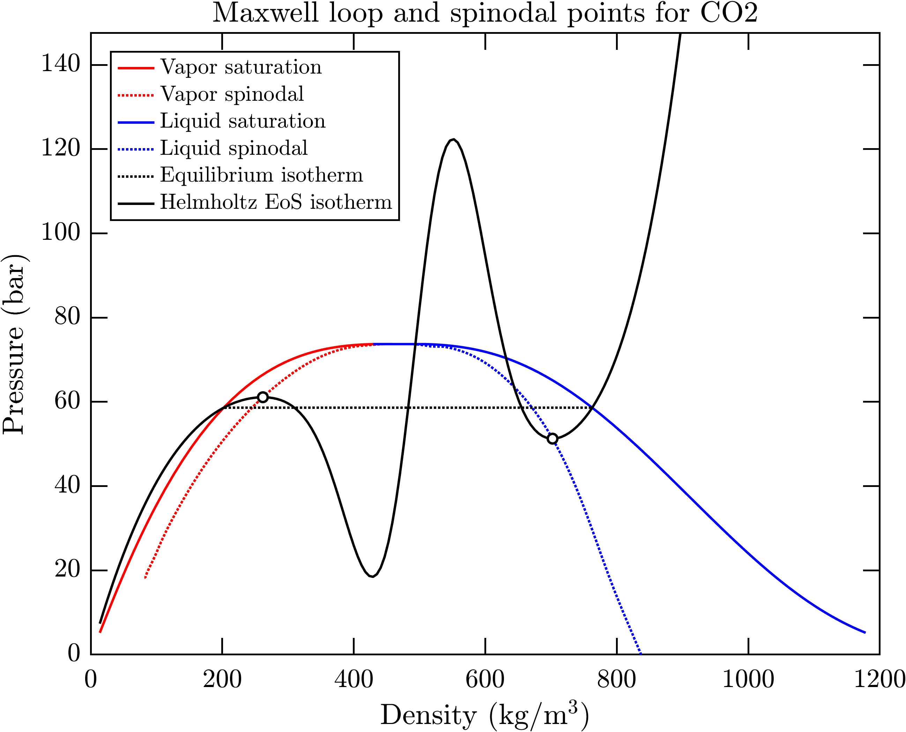
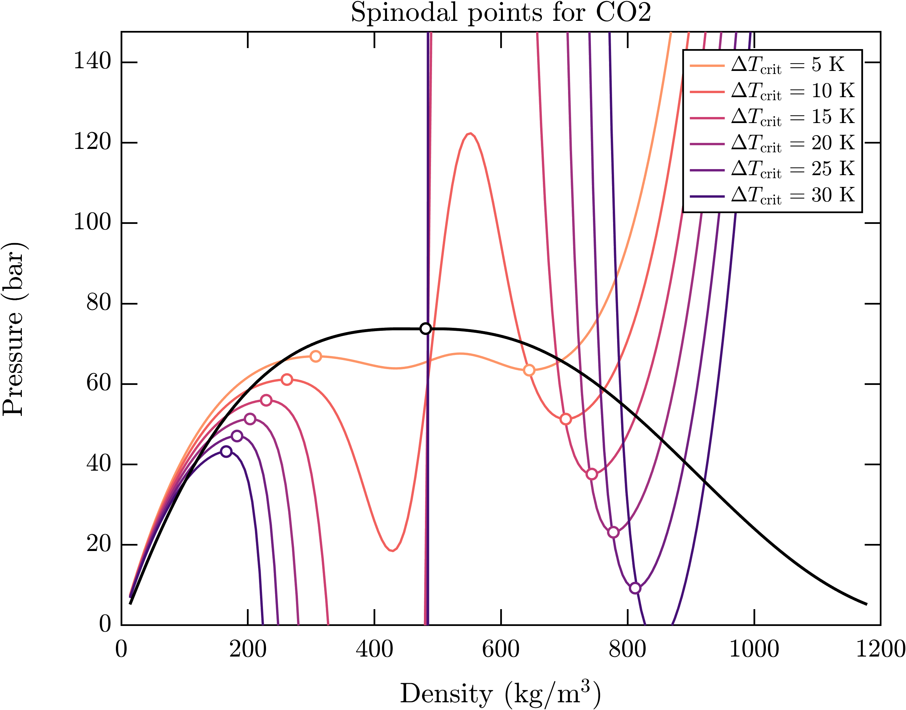
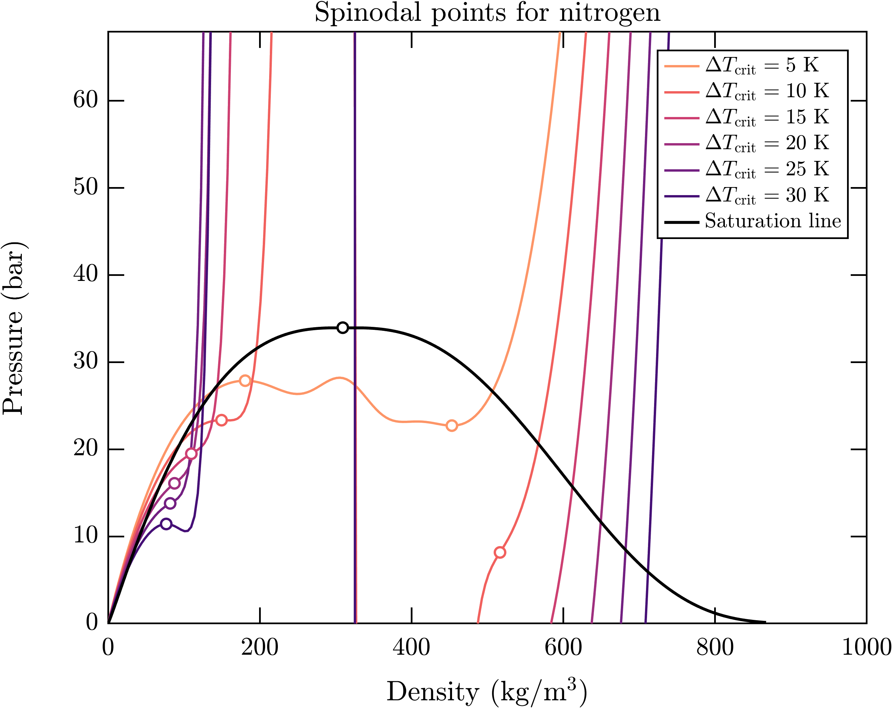

## Helmholtz Energy equation of state
Modern fluid property libraries (like REFPROP and CoolProp) use Helmholtz equations of state (HEOS) to evaluate the thermodynamic properties. These equations of state express the Helmholtz energy of the fluid as an explicit function of temperature and density:

$$\Phi = \Phi(\rho,T)$$

The equation of state can also be formulated in dimensionless form as:

$$ \phi(\delta, \tau) = \frac{\Phi(\delta, \tau)}{R\,T}$$

Where:
- $\phi$ is the dimensionless Helmholtz energy
- $R$ is the gas constant of the fluid
- $\delta=\rho/\rho_c$ is the reduced density
- $\tau=T_c/T$ is the inverse of the reduced temperature

$\frac{c_v}{R}= \frac{1}{R} \big(\frac{\partial u}{\partial T} \big)_{v} = -\tau^2 \, \phi_{\tau \tau}$

One of the advantages of the HEOS formulation is that any thermodynamic property (like pressure, enthalpy, or speed of sound) can be computed as a combination of density, temperature and the Helmholtz energy and its partial derivatives. The table below summarizes the expressions for many common thermodynamic properties:

| Property name | Mathematical relation | 
| -------- | -------- | 
| Pressure | $Z = \frac{p}{\rho R\,T}=\delta \, \phi_{\delta}$ |
| Entropy | $\frac{s}{R}=\tau \, \phi_{\tau} - \phi$ |
| Internal energy| $\frac{u}{R\,T}=\tau \, \phi_{\tau}$ |
| Enthalpy | $\frac{h}{R\,T}=\tau \,\phi_{\tau} + \delta\, \phi_{\delta}$ |
| Isochoric heat capacity | $\frac{c_v}{R}= \frac{1}{R}\left(\frac{\partial u}{\partial T}\right)_{v} = -\tau^2 \, \phi_{\tau \tau}$ |
| Isobaric heat capacity | $\frac{c_p}{R}= \frac{1}{R}\left(\frac{\partial h}{\partial T}\right)_{p} =-\tau^2 \, \phi_{\tau \tau} + \frac{\left(\delta \, \phi_{\delta} - \tau \delta \, \phi_{\tau \delta}\right)^2}{2\delta \, \phi_{\delta} + \delta^2 \, \phi_{\delta \delta}}$ |
| Isobaric expansivity | $\alpha \, T = -\frac{T}{\rho}\left( \frac{\partial \rho}{\partial T} \right)_p = \frac{\delta\,\phi_{\delta} - \tau \delta \, \phi_{\tau \delta}}{2\delta \, \phi_{\delta} + \delta^2\, \phi_{\delta \delta}}$  |
| Isothermal compressibility | $\rho R\, T\, \beta = R\, T \left( \frac{\partial \rho}{\partial p} \right)_T = \left(2\delta \, \phi_{\delta} + \delta^2 \, \phi_{\delta \delta} \right)^{-1}$ |
| Isothermal bulk modulus | $\frac{K_T}{\rho R \,T} = \frac{1}{R\, T} \left( \frac{\partial p}{\partial \rho} \right)_T = 2\delta \, \phi_{\delta} + \delta^2 \, \phi_{\delta \delta}$ |
| Isentropic bulk modulus | $\frac{K_s}{\rho R \, T} = \frac{1}{R\,T}\left(\frac{\partial p}{\partial \rho}\right)_{s} = \frac{c^2}{R\,T} = 2\delta \, \phi_{\delta} + \delta^2 \, \phi_{\delta \delta} - \frac{\left(\delta \, \phi_{\delta} - \tau \delta \, \phi_{\tau \delta}\right)^2}{\tau^2 \, \phi_{\tau \tau}}$ |
| Joule-Thompson coefficient | $\rho R \, \mu_{\mathrm{JT}} = \rho R \left( \frac{\partial T}{\partial p} \right)_{h} = - \frac{\delta \, \phi_{\delta} + \tau \delta \, \phi_{\tau \delta} + \delta^2 \, \phi_{\delta \delta}}{\left( \delta \, \phi_{\delta} - \tau \delta \, \phi_{\tau \delta} \right)^2 - \tau^2 \, \phi_{\tau \tau} \, \left( 2\delta\, \phi_{\delta} + \delta^2 \, \phi_{\delta \delta} \right) }$ |

where the following abbreviations where used:
- $\phi_{\delta} = \left(\frac{\partial \phi}{\partial \delta} \right)_{\mathrm{\tau}}$
- $\phi_{\tau}= \left(\frac{\partial \phi}{\partial \tau} \right)_{\mathrm{\delta}}$
- $\phi_{\delta\delta}= \left(\frac{\partial^2 \phi}{\partial \delta^2} \right)_{\mathrm{\tau,\tau}}$
- $\phi_{\tau\tau}= \left(\frac{\partial^2 \phi}{\partial \tau^2} \right)_{\mathrm{\delta, \delta}}$
- $\phi_{\tau\delta} = \left(\frac{\partial^2 \phi}{\partial \tau \delta} \right)_{\mathrm{\delta, \tau}}$

## Temperature-density input pairs
Helmholtz-energy equations of state are explicit in temperature and density. Therefore, when the the input variable pair is temperature-density the Helmholtz energy and its derivatives can be directly computed. Any other thermodynamic variable is then given by combination of the Helmholtz energy and its derivatives.

## Other thermodynamic input pairs
When the input pair is different than temperature-density the fluid library will have to solve non-linear equations to find the temperature-density pair that matches the input variables specified by the user.
- If the user specifies an input pair that contains temperature or density, but not both (for instance temperature-entropy or density-internal energy), the fluid library will use a 1D root-finding method to compute the temperature-density pair that matches the input variables and then return the desired thermodynamic properties. 
- If the user specifies an input pair that does not include temperature or density (for instance pressure-enthalpy or entropy-enthalpy) the fluid library will use a 2D root-finding method to compute the temperature-density pair that matches the input variables and then return the desired thermodynamic properties.

This type of function call is of course more computationally expensive because the root-finding methods are iterative procedures that make several function calls to the Helmholtz energy equation of state. In addition, this type of function calls may not converge at all if the initial guess for the temperature-density pair is not close enough to the correct solution.

## Two-phase region
The fluid libraries use the Helmholtz energy equation to evaluate the thermodynamic properties in the single-phase thermodynamic regions:
- Subcritical liquid
- Subcritical vapor
- Supercritical fluid

The properties in the two-phase region are not computed from the Helmholtz energy equation of state, but from equilibrium relations. To understand the reason for this consider the isotherm illustrated in the pressure-density diagram below.

It is well known that the pressure in the two-phase region depends only on temperature and, therefore, it should be constant along an isotherm line. However, the mathematical form of the HEOS produces unphysical wiggles known as Maxwell loops. Consequently, HEOS cannot be used predict the thermodynamic properties within the two-phase region. Instead, two-phase thermodynamic properties are computed using the rules described below.

### Mass-weighted averages
Intensive properties (like internal energy, enthalpy and entropy) are computed as mass-weighted averages of the saturated liquid/vapor states:

$$ u = q_{\mathrm{L}} \, u_{\mathrm{L}} + q_{\mathrm{V}} \, u_{\mathrm{V}}$$
$$ h = q_{\mathrm{L}} \, h_{\mathrm{L}} + q_{\mathrm{V}} \, h_{\mathrm{V}}$$
$$ s = q_{\mathrm{L}} \, s_{\mathrm{L}} + q_{\mathrm{V}} \, s_{\mathrm{V}}$$

where $q_{\mathrm{L}}$ and $q_{\mathrm{V}}$ are the the mass fractions of liquid and vapor, respectively.

### Volume weighted averages
The density and isobaric and isochoric heat capacities are computed as volume-weighted averages of the saturated liquid/vapor states:

$$ \rho_v = \alpha_{\mathrm{L}} \, \rho_{\mathrm{L}} + \alpha_{\mathrm{V}} \, \rho_{\mathrm{V}}$$
$$ c_v = \alpha_{\mathrm{L}} \, c_{v,\,\mathrm{L}} + \alpha_{\mathrm{V}} \, c_{v,\,\mathrm{V}}$$
$$ c_p = \alpha_{\mathrm{L}} \, c_{p,\,\mathrm{L}} + \alpha_{\mathrm{V}} \, c_{p,\,\mathrm{V}}$$

where $\alpha_{\mathrm{L}}$ and $\alpha_{\mathrm{V}}$ are the the volume fractions of liquid and vapor, respectively. Transport properties, including viscosity and conductivity are also computed as volume-weighted averages:

$$\mu = \alpha_{\mathrm{L}} \, \mu_{\mathrm{L}} + \alpha_{\mathrm{V}} \, \mu_{\mathrm{V}}$$
$$\kappa = \alpha_{\mathrm{L}} \, \kappa_{\mathrm{L}} + \alpha_{\mathrm{V}} \, \kappa_{\mathrm{V}}$$

### Speed of sound
The speed of sound for a homogeneous flow within the two-phase region is computed according to different formulas depending the level of equilibrium.

According to [Flåtten and Lund (2011)](https://doi.org/10.1142/S0218202511005775) if the two-phase mixture not in equilibrium (i.e., both phases have different pressures, temperatures and chemical potentials) the square of the speed of sound is given by the arithmetic average of the squared sound speed of the saturated liquid and vapor weighted on their mass fractions:

$$c^2 = q_{\mathrm{L}} \, c^2_{\mathrm{L}} + q_{\mathrm{V}} \, c^2_{\mathrm{V}}$$

If the two-phase mixture is in mechanical equilibrium (i.e., both phases have the same pressure, but different temperatures and chemical potentials) the bulk modulus of the mixture $\rho c^2$ is computed as the harmonic average of the bulk moduli of the saturated liquid and vapor weighted on their volume fractions:

$$\frac{1}{\rho c^2} = \frac{\alpha_{\mathrm{L}}}{\rho_{\mathrm{L}} c^2_{\mathrm{L}}} + \frac{\alpha_{\mathrm{V}}}{\rho_{\mathrm{V}} c^2_{\mathrm{V}}}$$

This expression is also known as Wood's formula, or as the Homogeneous Frozen Model (HFM) for the speed of sound.

Lastly, if the two-phase mixture is in mechanical, thermal, and phase equilibrium (i.e. both phases have the same pressure, temperature, and chemical potential) the speed of sound is given by the following expression:

$$\frac{1}{\rho c^2} = \frac{\alpha_{\mathrm{L}}}{\rho_{\mathrm{L}} c^2_{\mathrm{L}}} + \frac{\alpha_{\mathrm{V}}}{\rho_{\mathrm{V}} c^2_{\mathrm{V}}} + T \left( \frac{\rho_\mathrm{L} \alpha_\mathrm{L}}{c_{p,\,\mathrm{L}}} \left( \frac{\mathrm{ds_\mathrm{L}}}{\mathrm{d}p}\right)^2_{\mathrm{sat}} + \frac{\rho_\mathrm{V} \alpha_\mathrm{V}}{c_{p,\,\mathrm{V}}} \left( \frac{\mathrm{ds_\mathrm{V}}}{\mathrm{d}p}\right)^2_{\mathrm{sat}} \right)$$

This formula is also known as Homogeneous Equilibrium Model (HEM) for the speed of sound. Refer to the work from [Flåtten and Lund (2011)](https://doi.org/10.1142/S0218202511005775) for more information about the different speed of sound definitions.

### A warning about the speed of sound in CFD simulations
The solution of compressible CFD problems depends directly or indirectly on the speed of sound of sound (i.e., compressibility) of the fluid. Indeed, the speed of sound dictates the velocity at which acoustic waves propagate through the flow domain and affects compressible flow phenomena such as choking and shock wave formation. Therefore, the definition of the speed of sound will have a strong impact on the CFD results.

Most commercial single-phase CFD codes do not allow the user to set a custom definition for the speed of sound. Instead, they compute the speed of sound from the equation of state used to evaluate the thermodynamic properties (e.g., ideal gas law, barotropic model, real-gas property tables). Computing the speed of sound from the equation of state implicitly assumes complete equilibrium between the phase and, therefore, the speed of sound definition corresponds to the Homogeneous Equilibrium Model (HEM).

This means that the results obtained from a single-phase CFD code operating in the two-phase region implicitly assume that the speed of sound follows the Homogeneous Equilibrium Model (HEM).  Therefore, it is meaningless to post-process the flow solution using other speed of sound definitions because the flow field was not computed using those speed of sound values.

Also note that many single-phase CFD codes will not be able to compute flow solutions in the two-phase region because they are formulated using pressure and temperature as independent thermodynamic variables and equations of state using these variables are not well-posed in the two-phase region.

> Key message: In the context of a CFD simulation based on the barotropic model the the Homogeneous Equilibrium Model is the only consistent definition of the speed of sound because the relation between density and pressure/temperature that CFD solvers use internally is based on thermodynamic equilibrium.

## Metastable states and the spinodal line
When a single-phase fluid undergoes a thermodynamic process and enters the two-phase region it can temporarily exist in a single-phase state that is different from the equilibrium two-phase state. Such states are know as metastable states and they are only possible in the thermodynamic region between the saturation lines and the spinodal lines. If the thermodynamic process continues and crosses the spinodal lines metastable states become unstable and the transition to two-distinct phase occurs immediately. Therefore, the spinodal line represents the boundary that separates the region where a mixture is thermodynamically unstable and prone to phase separation from the region where metastable states are physically possible.

In mathematical terms, the spinodal line is defined as the loci of thermodynamic states in which the isothermal bulk modulus of the fluid is zero:

$$K_T = \rho \left( \frac{\partial p}{\partial \rho} \right)_T = 0$$

More precisely, a vapor spinodal point is the first local maximum of a isotherm line in a pressure-density diagram as the density increases. Conversely, a liquid spinodal point is the first local minimum of a isotherm line in a pressure-density diagram as the density decreases.  The figure below illustrates the spinodal point definition for the carbon dioxide HEOS developed by [Span and Wagner (1996)](https://doi.org/10.1063/1.555991).

The thermodynamic properties in metastable ses between the saturation and spinodal curves can be computed extrapolating the Helmholtz-energy equation of state beyond the single-phase region. However, state-of-the-art Helmholtz energy equations of state do not include metastable states in the set of data points used to fit the model parameters. Therefore, the accuracy of HEOS to estimate metastable thermodynamic properties is questionable.

In fact, it is well known that some Helmholtz energy equations of state cannot be used to estimate the location of the spinodal line because their mathematical form or set of fitting coefficients are not well-posed. This is exemplified by the nitrogen HEOS developed by [Span et al. (2000)](https://doi.org/10.1063/1.1349047). The figure below illustrates that the HEOS is not well-posed because there are isotherms that do not have a local minimum/maximum corresponding to a state with zero isothermal bulk modulus. In those case, the inflection point of the isotherms (corresponding to the point closest to zero bulk modulus) was marked for illustrating purposes.

