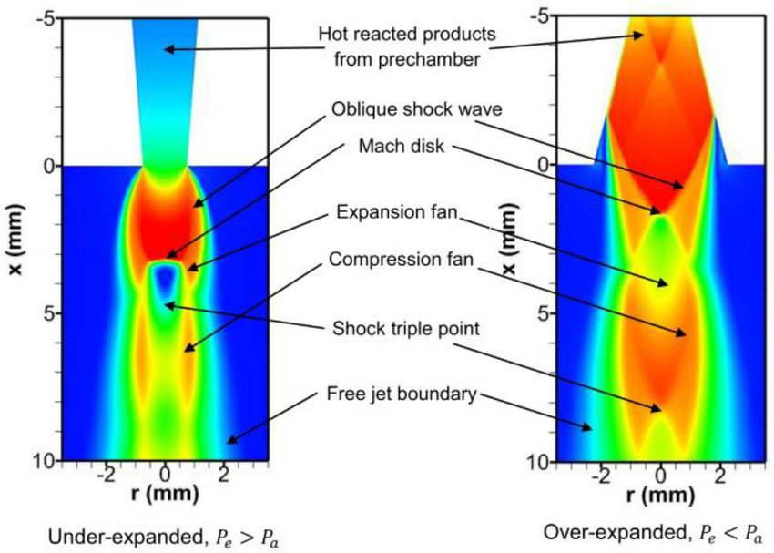

# Nitrogen-water nozzle simulation results

## Work done by Thursday 28-09-2023
- **Simulation cases**
  - Elliot1979 nitrogen-water nozzle in 2D
  - 8 cases at different mixture rations
  - Mesh: new mesh with inflation layers near wall
  - Surface roughness: 5 values from zero (i.e., smooth) to 50 micrometers (extremely rough).
- **Density mismatch problem:**
  - There is more information about this problem in a section below.
  - This problem was solved using a iteration strategy that gradually tightens the density-underrelaxation factor from 1 to a very low value as the number of itertions increases
  - The final density profile in fluent agrees exactly with the density calculated with the barotropic model expression.
  
- **Influence of the mesh:**
  - I ran these simulations using a mesh with inflation layers near the wall
  - The highest values of the y+ were around 100 in the worst cases.
  - There was no significant difference between the simulations using the Euler mesh and the simulation using the mesh with inflation layers near the wall
  
- **Experimental matching**
  - The CFD simulations can capture the effect of increasing exit velocity for lower mixture ratios
  - However, the barotropic model overpredicts the increase of exit velocity as the mixture ratio decreases. In other words, there is a good matching for the cases at high mixture ratio, but the deviation increases as the mixture ratio decreases.
  - This is probably because the void fraction increases and so does the impact of the slip between the liquid and the gas. This is an effect that the barotropic model cannot predict (as far as I am concerned)
  - With regards to the nozzle efficiency the barotropic model predicts an increase of efficiency as the fraction of nitrogen increases. This goes against the experimental data that indicates that the efficiency decreases as the mixture ratio decreases (most likely because of the increased drag between liquid and gas).
  - I think that the CFD simulations predict an increase of nozzle efficiency as the mixture ratio decreases because the viscosity and density of the fluid are lower when there is more nitrogen, and this reduces the viscous losses.
  
  
- **Thrust and velocity calculation**
  - The velocity shown in the plots is the "apparent" velocity calculated as the thrust divided by the mass flow rate (as it is done in the paper). I calculated the thrust as the sum of the velocity thrust and the pressure thrust (i.e., the thrust caused by the different between exit pressure and backpressure) using values obtained from the CFD simulations (see more information below)
  - The contribution of the pressure thrust is only significant for the cases at high mixture ratio because these cases are "underexpended" and there is a shockwave at the nozzle exit.
  - The matching of the experimental data is significantly better when considering the pressure thrust in the high-mixture-ratio cases.
  - The pressure thrust is negligible for the low-mixture-ratio cases because in these cases the nozzle is correctly expanded or slightly under expanded.
- **Influence of the wall surface roughness**
  - As expected the surface roughness decreases the exit velocity and increases friction in the nozzle
  - The simulations with 1 micrometer roughness are essentialy identical to the simulations with smooth walls
  - From the plots it can be seen that the effect of roughness cannot explain the difference between the CFD predictions and the experimental data
  - A we do not know the roughness of the nozzle walls, but a realistic value could probably be between 1 micrometer and 10 micrometers.
  - The difference in efficiency between the simulations with smooth walls and the simulation with a roughness height of 10 micrometers are about 3%.
  - This suggest that the effect of roughness is small, but not negligible for this case.
- **Overall comments**
  - The validation efforts for this case suggest that the barotropic model can predict the main features of the flow. In particular, the matching of the mass flow rate for the only case with experimental data was excellent.
  - However, the model was not able to predict the trend of nozzle efficiency as the mixture ratio decreases. In the worst case, the differentce in nozzle efficiency between the CFD predictions (smooth walls) and the experimental data was 20 percentage points at a mixture ratio of 22.4.
  

## Density under-relaxation
- Probem encountered:
  - Starting with overly high density under-relaxation prevents correct convergence.
  - Mismatch between Fluent's internal density field and barotropic model's pressure-related density prediction.
  - Confirmed mismatch not due to polynomial evaluation but density under-relaxation.
- Suggested strategy:
  - Start with high density under-relaxation (0.5-1.0).
  - If residuals stall or fluctuate, decrease density under-relaxation to enhance convergence.
  - Residual stalling often linked to shock waves or rapid gradients.
- Results/conclusion:
  - Implemented a step-wise solution approach, tightening density under-relaxation from 1 to 1e-9.
  - Confirmed that reducing density under-relaxation slows density field updates.
  - Even with small density under-relaxation, the density field still changes gradually when nearing convergence (the density field is not completely frozen)

## Barotropic Model as UDF
- Developed barotropic model as a C++ UDF.
  - Supports polynomials of all orders.
  - Utilizes Horner's rule for evaluation.
  - Function added to export model as user-defined-scalars for validation.
- Ran simulations comparing UDF and expressions (Elliot1979 case).
- Identical outcomes from UDF and expression-based simulations (when there are no density deviations).
- UDF allows for explicit speed of sound definition.
  - Only affects equation convergence (user manual says it "stabilizes" the solution)
  - No impact on the final solution: pressure and density fields align, despite internal speed variances between UDF and expressions.
- Expressions are simpler and more time-efficient -> they are the preferred approach

## Nozzle thrust equation
- The paper's average velocity is based on the nozzle thrust equation: 
$$F = \dot{m}\,v $$
- This equation doesn't account for thrust due to differences in exit and backpressure when nozzle backpressure isn't adapted. Corrected equation:
  $$ F = \dot{m}\,v + A_{e}(p_e - p_b) $$
- Where $p_e$ is nozzle exit pressure and $p_b$ is backpressure (ambient pressure boundary condition).
- Infuence of inlet on thrust equation:
  - Question raised: Is thrust influenced by inlet velocity and pressure?
  - Possible answer: Likely not if inlet ports connect to flexible hoses that don't transmit reaction force. In such cases, the reaction force might only be felt in the thrust meter's stiff fittings.
- Simulation results:
  - Observed both overexpanded and underexpanded nozzle cases depending on mixture ratio:
  - To predict exit pressure-velocity (and thrust) accurately for overexpanded cases, it might be necessary to extend computational domain to ambient.
  - Some overexpanded nozzle cases, with shock waves at the boundary condition, didn't converge without reducing density under-relaxation.
  - Tests without shock waves converged well even without under-relaxation.
- Advised to adjust the computational domain to include the atmosphere downstream of the nozzle. This captures effects downstream, ensuring boundary conditions don't impact the domain's last cell and allowing for accurate modeling of shocks and expansion waves (would results change?)

## Work to do in the future
- Extend the validation of the model using the data from Elliot1968:
  - The experimental dataset for this nozzle was limited because:
    - No data about surface pressure distribution
    - The mass flow rate was only reported at one mixture ratio
    - The exit velocity was reported for all mixture ratios, but not the corresponding thrust and mass flow rates
  - Thes limitation could be overcome using the experimental data from Elliot 1968, which includes:
    - Suface pressure distribution along the nozzle
    - Mass flow rate and thrust measurements for many mixture ratios
  - In addition, the nozzle from Elliot 1968 features a larger nozzle in which the effects of surface roughness are expected to be negligible.
- The computational domain of the problem should be extended downstream the nozzle:
  - The reason for this is that some cases correspond to over-expanded or under-expanded nozzles
  - Since the computational domain does not extend downstream the nozzle the CFD simulations cannot capture the expansion/compression processes hapening after the nozzle for in which the exit pressure does not match the backpressure
  