# Centrifugal impeller tutorial

This tutorial shows how to use the **barotropy** Python package to generate barotropic property models and use them in **ANSYS CFX**.

You can download the CFX files used in this tutorial from this [GitHub release](https://github.com/turbo-sim/barotropy/releases/tag/cfx_tutorial).

## 1. Installation

Create a clean Python environment and install `barotropy`.

### Option 1: Using Conda

If you use miniconda to manage your virtual environemnts

```bash
conda create -n barotropy-env python=3.10 -y
conda activate barotropy-env
pip install barotropy
```

### Option 2: Using Python `venv`

If you prefer to avoid conda you can also create a lightweight virtual environmnet using `venv`.
If you are using git-bash on windows

```bash
python -m venv env
source env/Scripts/activate
python -m pip install barotropy
```

Or if you are using Linux or mcOS

```bash
python3 -m venv env
source env/bin/activate
pip install barotropy
```


## 2. Generate the barotropic model

To generate the barotropic model, simply run the script:

```bash
python create_barotropic_model.py
```

This will:
- Simulate a barotropic expansion of **CO₂**
- Fit polynomial expressions for key properties
- Export CFX-compatible expressions in `barotropic_model/CFX_expressions.txt`
- Save plots and polynomial data in the `barotropic_model/` folder

Below is a breakdown of the main script components.


### Step 2.1: Define the fluid and thermodynamic conditions

We use **CO₂**, compressing from **310 K** and **90 bar**. The maximum (outlet) pressure is set to five times the inlet pressure to cover a broad range of thermodynamic states. The minimum pressure is set to 90 % of the inlet pressure to ensure that properties at slightly lower pressures are available—relevant for modeling fluid acceleration at the impeller inlet.


```python
fluid_name = "CO2"
fluid = bpy.Fluid(name=fluid_name, backend="HEOS")
T_in = 310.0       # [K]
p_in = 90.0e5      # [Pa]
p_min = 5.0*p_in   # [Pa]
p_max = 0.9*p_in   # [Pa]
```

The corresponding expansion is illustrated in the temperature-entropy diagram below

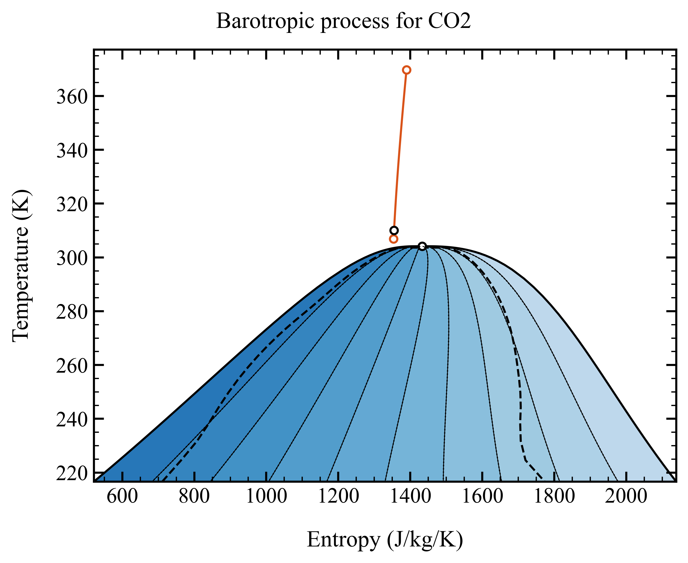


### Step 2.2: Set up the barotropic model


We assume **thermodynamic equilibrium** during compression, which is not an issue for single-phase flow, and specify a **polytropic efficiency of 80 %**. The barotropic model is set up to fit **fifth-degree polynomials** for the variables listed in ``polynomial_variables``. Since both `p_min` and `p_max` are provided, we must explicitly specify `process_type="compression"`, as the direction of the process cannot be inferred from the inlet and outlet pressures.


```python
model = bpy.BarotropicModel(
    fluid_name=fluid_name,
    T_in=T_in,
    p_in=p_in,
    p_min=p_min,
    p_max=p_max,
    efficiency=0.8,
    process_type="compression",
    calculation_type="equilibrium",
    HEOS_solver="hybr",
    ODE_solver="LSODA",
    ODE_tolerance=1e-9,
    polynomial_degree=5,
    polynomial_format="horner",
    output_dir=DIR_OUT,
    polynomial_variables=["density", "viscosity", "speed_sound", "void_fraction", "vapor_quality"],
)
```


### Step 2.3: Solve, export, and visualize

We evaluate the expansion, fit the polynomials, export the expressions, and generate plots of the thermodynamic path and fitting error for each variable.

```python
model.solve()
model.fit_polynomials()
model.export_expressions_fluent(output_dir=DIR_OUT)
model.export_expressions_cfx(output_dir=DIR_OUT)

model.poly_fitter.plot_phase_diagram(
    fluid=fluid,
    var_x="s",
    var_y="T",
    savefig=True,
    showfig=True,
    plot_spinodal_line=True,
)

for var in model.poly_fitter.variables:
    model.poly_fitter.plot_polynomial_and_error(
        var=var,
        savefig=True,
        showfig=True,
    )
```

The output barotropic model for density is illustrated below, note the slop discontinuity when the fluid enters the two-phase region:


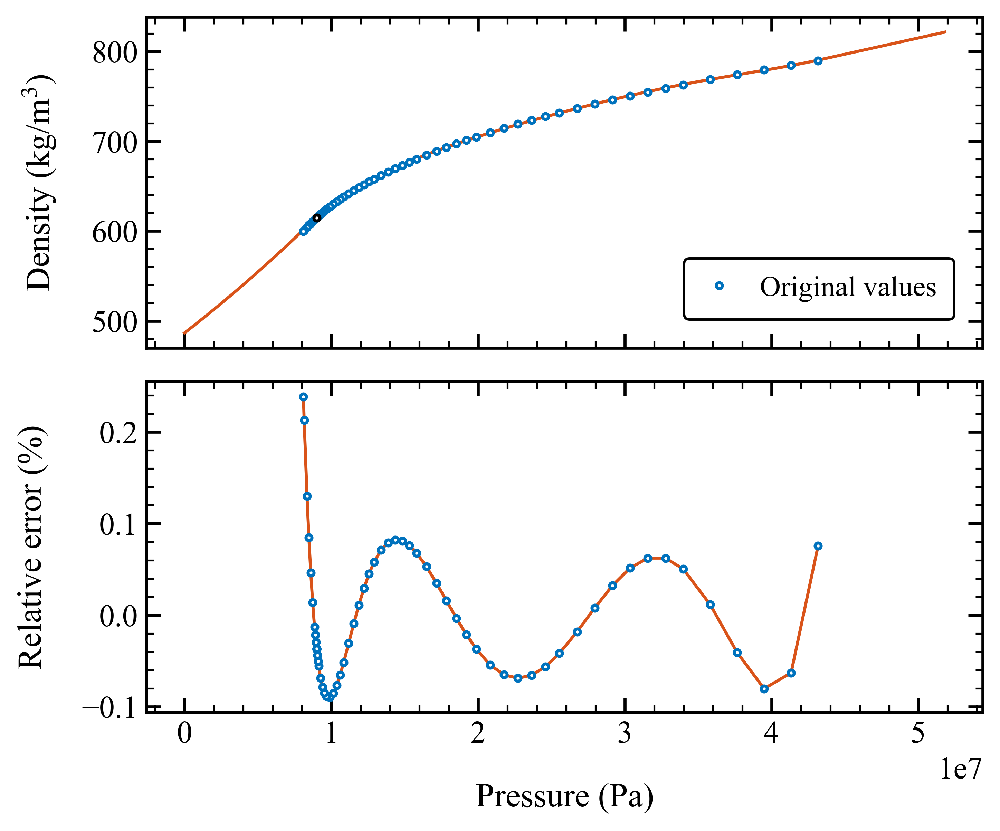


## 3. Use the barotropic model in ANSYS CFX

Here’s a refined version of the section with your requested introduction:

---

## 3. Use the barotropic model in ANSYS CFX

This case is based on a **centrifugal compressor impeller**. The geometry provided should work out of the box, but you can modify it if needed.

To adjust the geometry or mesh:

1. Open the `centrifugal_impeller.wbpj` Workbench file.

   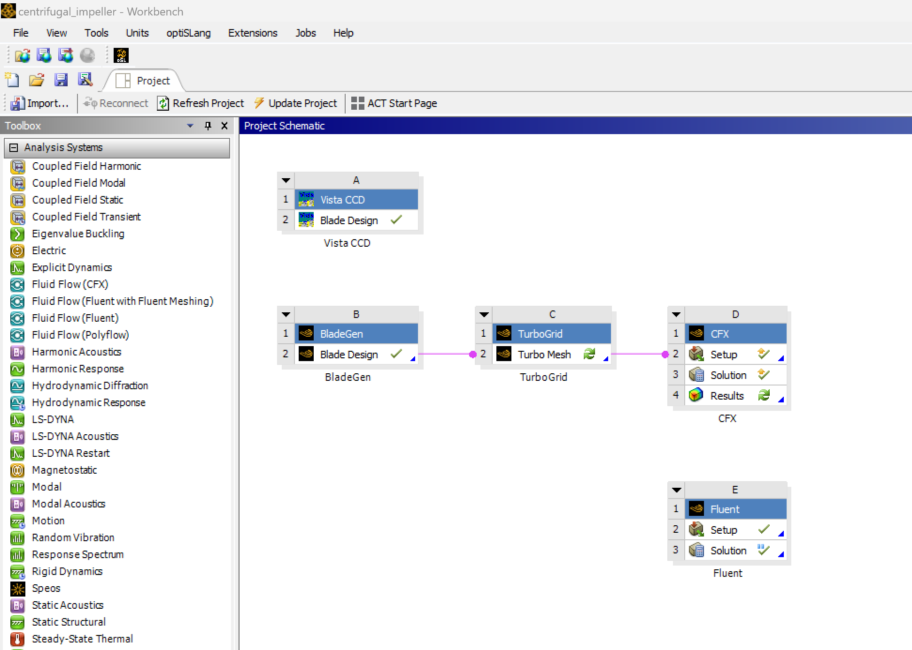

2. Use **Ansys BladeGen** to modify the impeller geometry:

   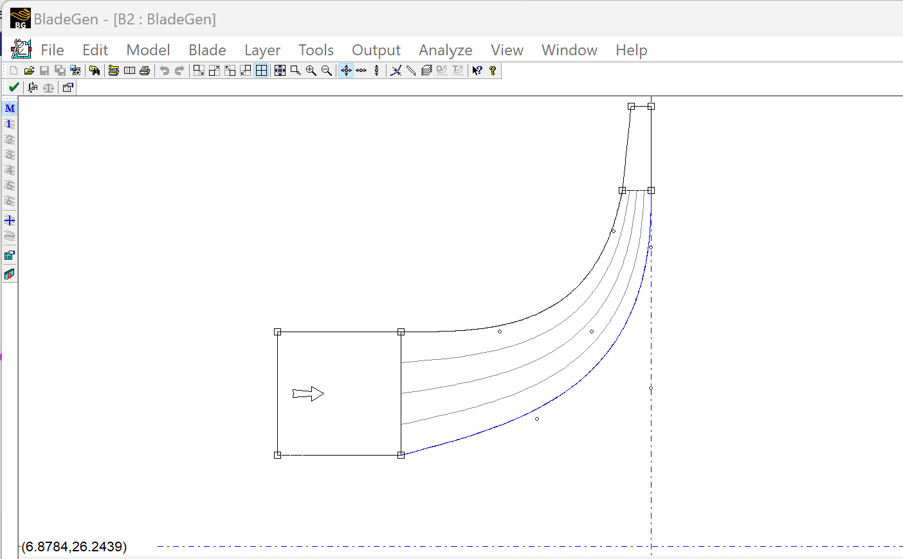

3. Adjust the mesh settings in **Ansys TurboGrid**:

   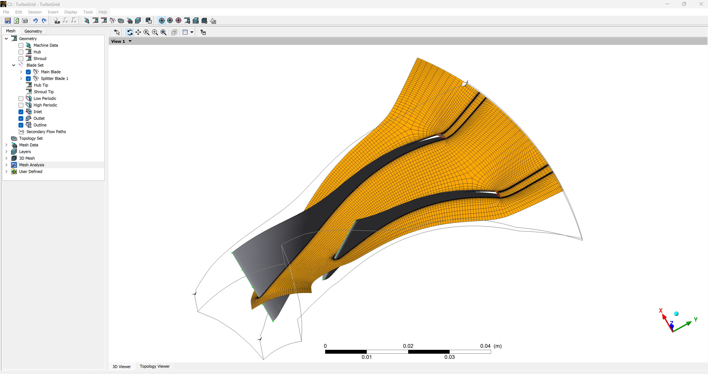

Once the mesh is ready, open **Ansys CFX-Pre** to configure the CFD simulation:


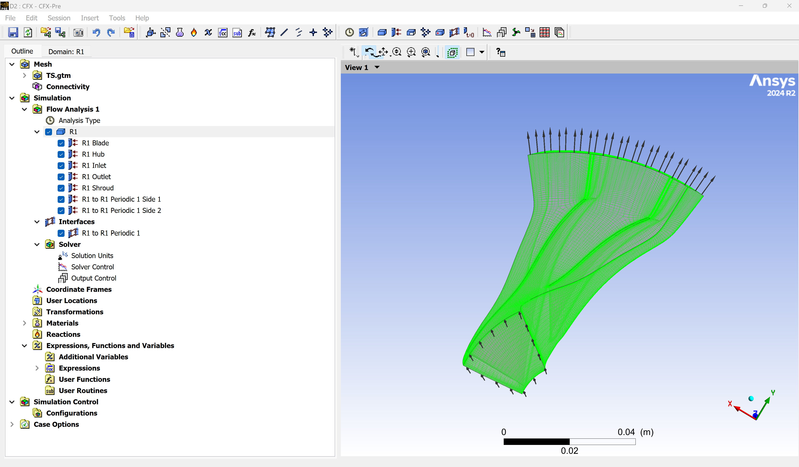


### Step 3.2: Check CFX expressions

Open the file `barotropic_model/cfx_expressions.txt`. It contains CFX-compatible expressions for:

- `barotropic_density`
- `barotropic_viscosity`
- `barotropic_speed_sound`
- `barotropic_void_fraction`
- `barotropic_vapor_quality`

Each expression is defined as a function of absolute pressure in Pascal. Example snippet:

```bash
CFX expressions for barotropic properties
Creation datetime: 2025-04-01 21:46:00.584473

barotropic_density
(if(Absolute Pressure >= 4.3172602232385412e+07 [Pa], 
7.9029740467060265e+02 + 1.5585573580243636e+02 * (Absolute Pressure / 4.3172602232385412e+07 [Pa] - 1.0000000000000000e+00), 
if(Absolute Pressure >= 8.1000000000000075e+06 [Pa], 
3.7719286741630594e+02 + (Absolute Pressure / 4.3172602232385412e+07 [Pa]) *
(1.9069634173268196e+03 + (Absolute Pressure / 4.3172602232385412e+07 [Pa]) *
(-5.0217902319823761e+03 + (Absolute Pressure / 4.3172602232385412e+07 [Pa]) *
(7.5391828666755409e+03 + (Absolute Pressure / 4.3172602232385412e+07 [Pa]) *
(-5.7311817562421811e+03 + (Absolute Pressure / 4.3172602232385412e+07 [Pa]) *
(1.7199302414764936e+03))))), 
6.0129371881930194e+02 * exp((Absolute Pressure / 4.3172602232385412e+07 [Pa] - 0.1876189893859094) / (8.8685400882947685e-01))))) * 1 [kg/m^3]

barotropic_viscosity
(if(Absolute Pressure >= 4.3172602232385412e+07 [Pa], 
7.2125104547306039e-05 + 2.5165884862101540e-05 * (Absolute Pressure / 4.3172602232385412e+07 [Pa] - 1.0000000000000000e+00), 
if(Absolute Pressure >= 8.1000000000000075e+06 [Pa], 
2.0001983602077405e-05 + (Absolute Pressure / 4.3172602232385412e+07 [Pa]) *
(1.9944217404247922e-04 + (Absolute Pressure / 4.3172602232385412e+07 [Pa]) *
(-4.8758152175582535e-04 + (Absolute Pressure / 4.3172602232385412e+07 [Pa]) *
(7.2428379252763341e-04 + (Absolute Pressure / 4.3172602232385412e+07 [Pa]) *
(-5.4814199609366592e-04 + (Absolute Pressure / 4.3172602232385412e+07 [Pa]) *
(1.6412067222460730e-04))))), 
4.4400199113488022e-05 * exp((Absolute Pressure / 4.3172602232385412e+07 [Pa] - 0.1876189893859094) / (5.5845319585495468e-01))))) * 1 [Pa*s]

```


### Step 3.3: Define custom named expressions

Navigate to **"Expressions, Functions and Variables"** in the *Outline*, then open the **Expressions Editor**.

Create two expressions:  
- `barotropicDensity`  
- `barotropicViscosity`

Copy and paste the corresponding content from `barotropic_model/cfx_expressions.txt` into each expression field.

You can plot the expressions directly in CFX to verify correctness.  
Note that **CFX-Pre uses single-precision arithmetic**, so high-degree or ill-conditioned polynomials may not display correctly. Using **polynomial degrees between 4 and 6** typically gives good results.

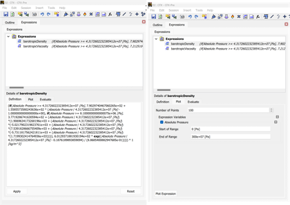


### Step 3.4: Create a barotropic fluid and assign expressions

Define a **new fluid** in CFX:

- Set `Density` and `Dynamic Viscosity` as **Expressions**, using the previously defined functions (e.g., `barotropicDensity`, `barotropicViscosity`)
- Specify a **dummy value for heat capacity** (this is required by CFX even if not used)
- Set **minimum and maximum limits** for **Absolute Pressure**. It’s  not clear how CFX handles these limits internally

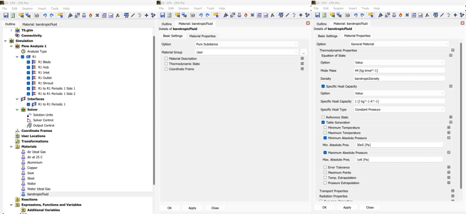


### Step 3.5: Assign the barotropic fluid to the flow domain

Go to the `Simulation` menu and open the settings for the flow domain `R1` (which stands for Rotor 1).

- In the **Basic Settings** tab, select `barotropicFluid` as the **material** and set the **angular velocity** of the domain.  
- In the **Fluid Models** tab, set **Heat Transfer** to *Isothermal* (this disables the energy equation) and choose your desired **turbulence model**.

  
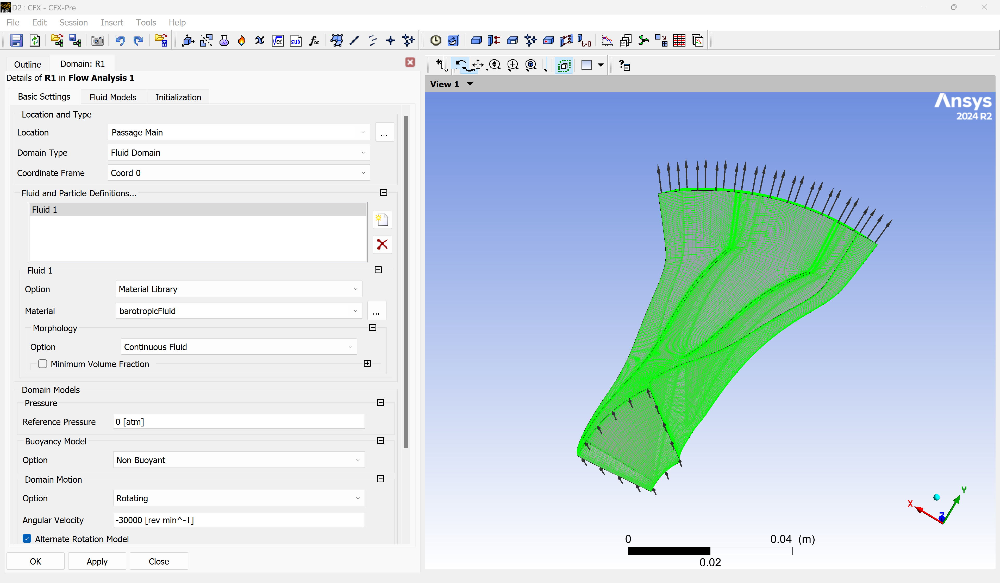  
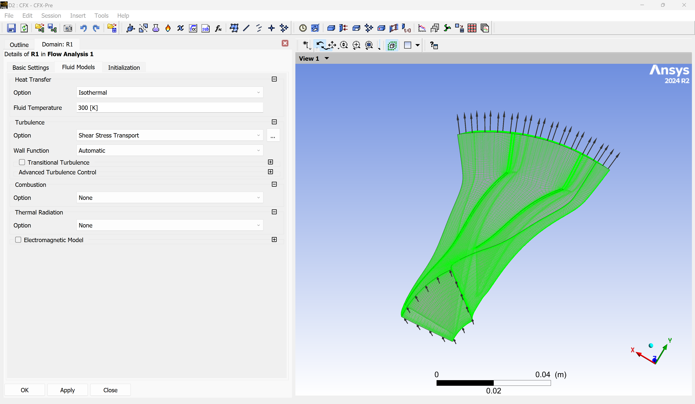  


### Step 3.6: Define boundary conditions

Open the **"R1 Inlet"** boundary and set the **total pressure**.

  

Then open the **"R1 Outlet"** boundary and define the **mass flow rate**.  
A value of **6.0 kg/s** is selected to operate slightly below the choking condition for the given rotational speed, ensuring operation within the surge and choke margins.

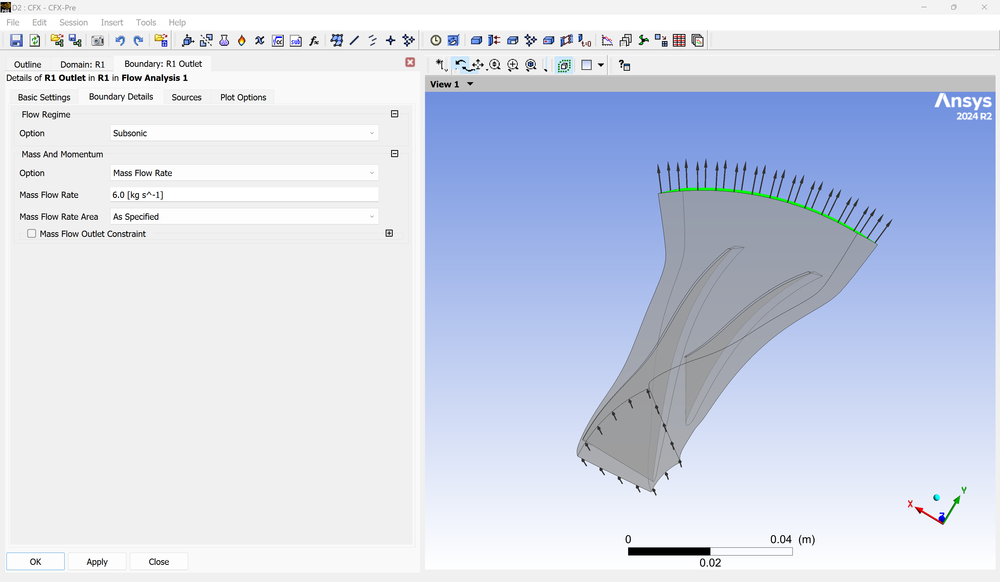


### Step 3.7: Set solver parameters

Go to the `Solver Control` section and open the **Basic Settings** tab.

Here, you can:

- Select the discretization schemes for the flow and turbulence equations  
- Set the **Timescale Factor** to control the convergence speed toward a steady-state solution  
- Define the **Residual Targ** for the simulation

The timescale should be chosen to ensure stable and efficient convergence.

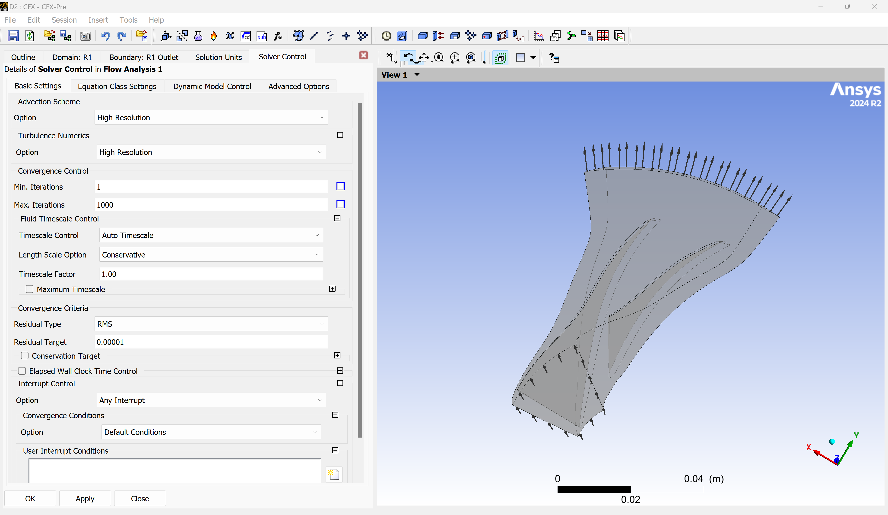


### Step 3.8: Run the simulation

Save and close **CFX Pre**, then open the **CFX Solver Manager**.

Select the number of CPU cores and start the simulation.

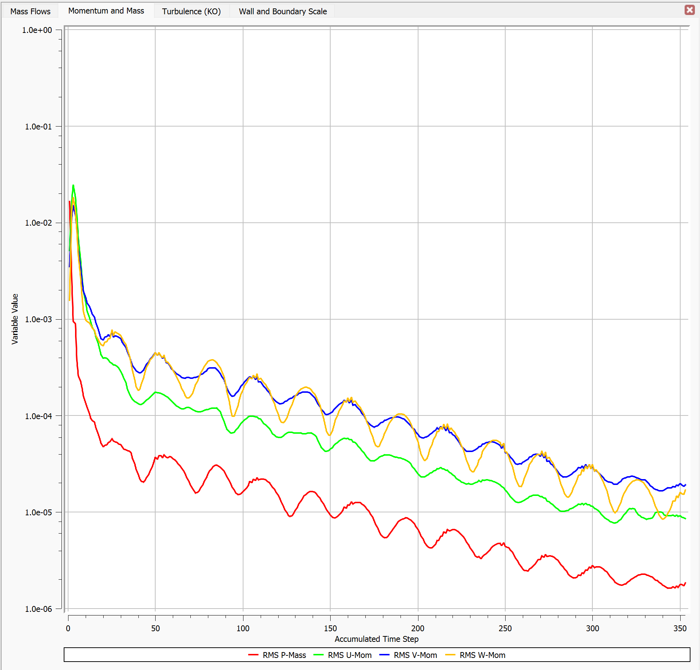

After convergence, open the results in **CFD Post** for visualization.

Note: The **turbomachinery report** in CFD Post may show errors. This is expected—since the barotropic model does not compute entropy or enthalpy, some predefined macros will fail. It does not affect the validity of the simulation.

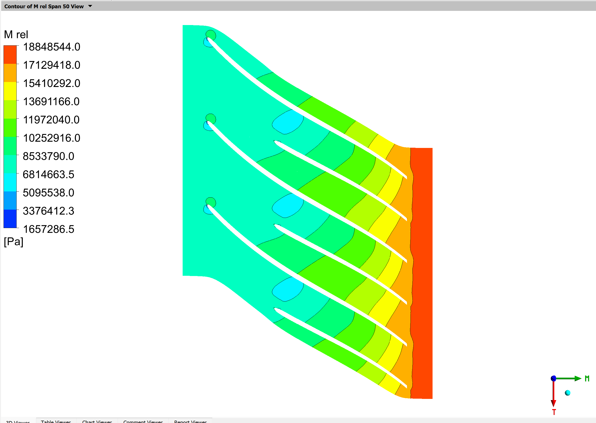
