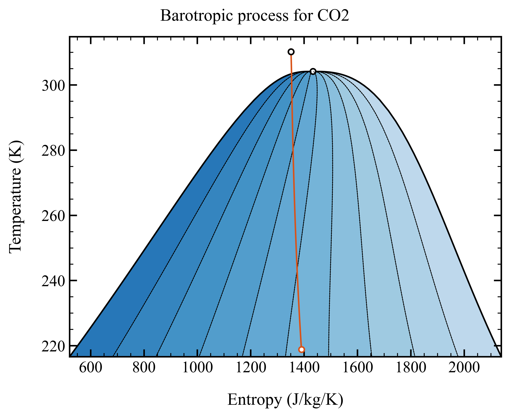
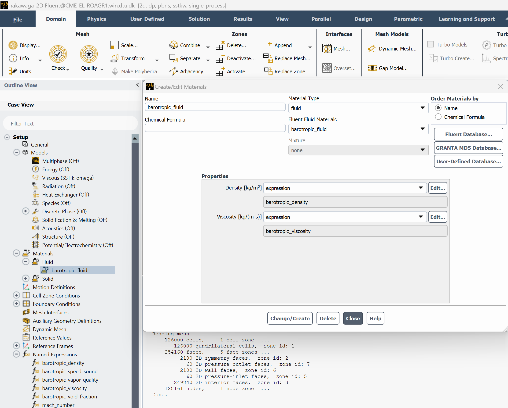
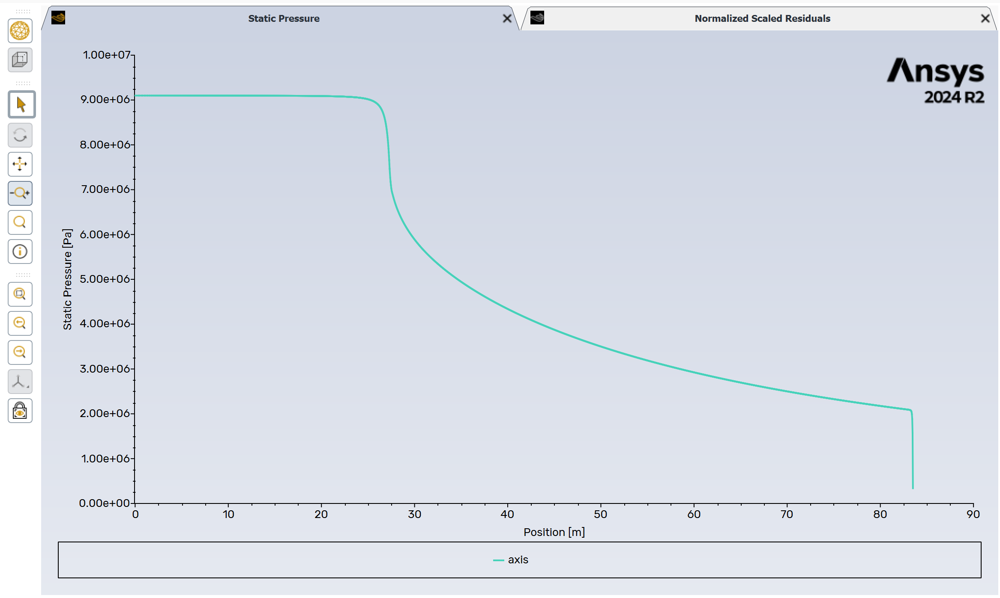

# Flashing nozzle tutorial

This tutorial shows how to use the **barotropy** Python package to generate barotropic property models and use them in **ANSYS Fluent**.

## 1. Installation

Create a clean Python environment and install `barotropy`.

### Option 1: Using Conda

If you use miniconda to manage your virtual environemnts

```bash
conda create -n barotropy-env python=3.10 -y
conda activate barotropy-env
pip install barotropy
```

### Option 2: Using Python `venv`

If you prefer to avoid conda you can also create a lightweight virtual environmnet using `venv`.
If you are using git-bash on windows

```bash
python -m venv env
source env/Scripts/activate
python -m pip install barotropy
```

Or if you are using Linux or mcOS

```bash
python3 -m venv env
source env/bin/activate
pip install barotropy
```


## 2. Generate the barotropic model

To generate the barotropic model, simply run the script:

```bash
python create_barotropic_model.py
```

This will:
- Simulate a barotropic expansion of **CO₂**
- Fit polynomial expressions for key properties
- Export Fluent-compatible expressions in `barotropic_model/fluent_expressions.txt`
- Save plots and polynomial data in the `barotropic_model/` folder

Below is a breakdown of the main script components.


### Step 2.1: Define the fluid and thermodynamic conditions

We use **CO₂**, expanding from **37.00 °C** and **91 bar**. The outlet pressure is set to just above the triple point to cover a wide range of thermodynamic states into the two-phase region.

```python
fluid_name = "CO2"
fluid = bpy.Fluid(name=fluid_name, backend="HEOS")
T_in = 37.00 + 273.15                       # [K]
p_in = 91e5                                 # [Pa]
p_out = 1.1 * fluid.triple_point_liquid.p   # [Pa]
```

The corresponding expansion is illustrated in the temperature-entropy diagram below




### Step 2.2: Set up the barotropic model

We assume **thermodynamic equilibrium** during expansion and define a **polytropic efficiency of 80%**. The model is configured to fit **fifth-degree polynomials** for the properties specified in ``polynomial_variables``:


```python
model = bpy.BarotropicModel(
    fluid_name=fluid_name,
    T_in=T_in,
    p_in=p_in,
    p_out=p_out,
    efficiency=0.8,
    calculation_type="equilibrium",
    HEOS_solver="hybr",
    ODE_solver="LSODA",
    ODE_tolerance=1e-9,
    polynomial_degree=5,
    polynomial_format="horner",
    output_dir=DIR_OUT,
    polynomial_variables=[
        "density", "viscosity", "speed_sound",
        "void_fraction", "vapor_quality",
    ],
)
```


### Step 2.3: Solve, export, and visualize

We evaluate the expansion, fit the polynomials, export the expressions, and generate plots of the thermodynamic path and fitting error for each variable.

```python
model.solve()
model.fit_polynomials()
model.export_expressions_fluent(output_dir=DIR_OUT)
model.export_expressions_cfx(output_dir=DIR_OUT)

model.poly_fitter.plot_phase_diagram(
    fluid=fluid,
    var_x="s",
    var_y="T",
    savefig=True,
    showfig=True,
    plot_spinodal_line=True,
)

for var in model.poly_fitter.variables:
    model.poly_fitter.plot_polynomial_and_error(
        var=var,
        savefig=True,
        showfig=True,
    )
```

The output barotropic model for density is illustrated below, note the slop discontinuity when the fluid enters the two-phase region:


## 3. Use the barotropic model in ANSYS Fluent

### Step 3.1: Set boundary conditions

In Fluent, define the boundary conditions for a high-expansion simulation:

- Set **inlet pressure** to `91 bar`
- Leave **inlet temperature** undefined (the barotropic model does not solve the energy equation)
- Set a **low outlet pressure** to simulate a **supersonic expansion**


### Step 3.2: Load Fluent expressions

Open the file `barotropic_model/fluent_expressions.txt`. It contains Fluent-compatible expressions for:

- `barotropic_density`
- `barotropic_viscosity`
- `barotropic_speed_sound`
- `barotropic_void_fraction`
- `barotropic_vapor_quality`


Each expression is defined as a function of absolute pressure in Pascal. Example snippet:

```bash
FLUENT expressions for barotropic properties
Creation datetime: 2025-04-01 18:06:17.871687

barotropic_density
(IF(AbsolutePressure >= 9.0999999999999702e+06 [Pa], 
6.2148013934931805e+02 + 1.5932422444928670e+02 * (AbsolutePressure / 9.0999999999999702e+06 [Pa] - 1.0000000000000000e+00), 
IF(AbsolutePressure >= 5.6976077766833338e+05 [Pa], 
IF(AbsolutePressure >= 7.2572793508720277e+06 [Pa], 
-5.1363315356843734e+04 + (AbsolutePressure / 9.0999999999999702e+06 [Pa]) *
(2.8009287872990133e+05 + (AbsolutePressure / 9.0999999999999702e+06 [Pa]) *
(-6.0539298600144289e+05 + (AbsolutePressure / 9.0999999999999702e+06 [Pa]) *
(6.5489011014216742e+05 + (AbsolutePressure / 9.0999999999999702e+06 [Pa]) *
(-3.5420812394309556e+05 + (AbsolutePressure / 9.0999999999999702e+06 [Pa]) *
(7.6602916568662738e+04))))), 
-1.2569038576746436e+00 + (AbsolutePressure / 9.0999999999999702e+06 [Pa]) *
(4.7061624129454106e+02 + (AbsolutePressure / 9.0999999999999702e+06 [Pa]) *
(-2.5560853135338277e+02 + (AbsolutePressure / 9.0999999999999702e+06 [Pa]) *
(1.7672907867012368e+03 + (AbsolutePressure / 9.0999999999999702e+06 [Pa]) *
(-2.3964310754149801e+03 + (AbsolutePressure / 9.0999999999999702e+06 [Pa]) *
(1.3676395581198071e+03)))))), 
2.7605122354415986e+01 * exp((AbsolutePressure / 9.0999999999999702e+06 [Pa] - 0.06261107446904783) / (6.0385944414899369e-02))))) * 1 [kg/m^3]

barotropic_viscosity
(IF(AbsolutePressure >= 9.0999999999999702e+06 [Pa], 
4.6730575276920754e-05 + 1.8742465072250220e-05 * (AbsolutePressure / 9.0999999999999702e+06 [Pa] - 1.0000000000000000e+00), 
IF(AbsolutePressure >= 5.6976077766833338e+05 [Pa], 
IF(AbsolutePressure >= 7.2572793508720277e+06 [Pa], 
-5.0760061781238647e-03 + (AbsolutePressure / 9.0999999999999702e+06 [Pa]) *
(2.7602395307420261e-02 + (AbsolutePressure / 9.0999999999999702e+06 [Pa]) *
(-5.9675812273308884e-02 + (AbsolutePressure / 9.0999999999999702e+06 [Pa]) *
(6.4571707824639418e-02 + (AbsolutePressure / 9.0999999999999702e+06 [Pa]) *
(-3.4930618757101566e-02 + (AbsolutePressure / 9.0999999999999702e+06 [Pa]) *
(7.5550646517515540e-03))))), 
1.0673315810985840e-05 + (AbsolutePressure / 9.0999999999999702e+06 [Pa]) *
(5.1178089099233773e-05 + (AbsolutePressure / 9.0999999999999702e+06 [Pa]) *
(-7.2644038743756688e-05 + (AbsolutePressure / 9.0999999999999702e+06 [Pa]) *
(1.2676076730927402e-04 + (AbsolutePressure / 9.0999999999999702e+06 [Pa]) *
(-7.7702338622608316e-05 + (AbsolutePressure / 9.0999999999999702e+06 [Pa]) *
(1.2240006030135682e-05)))))), 
1.3622786101453386e-05 * exp((AbsolutePressure / 9.0999999999999702e+06 [Pa] - 0.06261107446904783) / (3.1319008320950764e-01))))) * 1 [Pa*s]

```


### Step 3.3: Define custom named expressions

Define **Named Expressions** in Fluent to specify the fluid properties as functions of pressure.

- `barotropic_density` and `barotropic_viscosity` are **mandatory** — these are used during the CFD solution.
- The other expressions (`speed_sound`, `void_fraction`, `vapor_quality`) are **optional** and can be used for **postprocessing**.

Copy and paste the corresponding content from `barotropic_model/fluent_expressions.txt` into each expression field.

You can plot each expression directly in Fluent to verify correctness.


### Step 3.4: Create a barotropic fluid and assign expressions

Define a **new fluid** in Fluent:

- Set `density` and `viscosity` as functions using your previously defined expressions (e.g., `barotropic_density`, `barotropic_viscosity`)
- **Disable the energy equation**, as the barotropic model assumes isentropic behavior and does not solve for temperature




### Step 3.5: Initialize and run the simulation

- Use **Hybrid Initialization** to initialize the flow field
- Start solving with a **time scale factor of 1.0**
- After a few iterations, you can increase the time scale factor to accelerate convergence

The convergence history and final pressure distribution should resemble the examples below:





